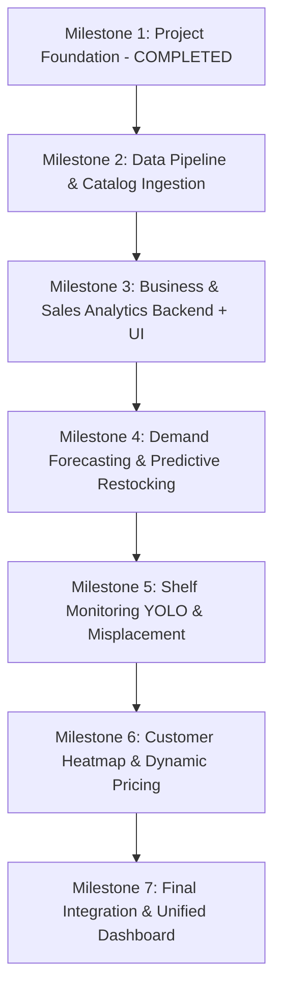

# Smart Retail Intelligence System — Dataset Audit Report

**Date of Audit:** 2026-08-25  
**Dataset Root Location:** `C:\Users\CHANDAN\Downloads\SmartRetailData`  
**Execution Environment:** Python 3.14.6 / CPU (No local CUDA device)  
**Timeline Constraint:** 2-Day Implementation Delivery  

---

## 1. Executive Summary & Dataset Availability Matrix

| Directory | Dataset Name | Total Size | Modality | Primary Supported Module | Status in Project |
| :--- | :--- | :--- | :--- | :--- | :--- |
| `01_SKU110K` | **SKU-110K Fixed** | 14.06 GB | Image + YOLO Txt | **Module 1: Shelf Monitoring**<br>**Module 5: Misplacement Detection** | Available (Ready for YOLO) |
| `02_M5` | **M5 Forecasting** | 429.61 MB | Tabular CSV | **Module 3: Predictive Restocking**<br>**Module 4: Dynamic Pricing** | Available (Ready for ETL) |
| `03_Rossmann` | **Rossmann Store Sales** | 37.99 MB | Tabular CSV | **Module 6: Business Dashboard**<br>**Module 3: Store Demand Forecast** | Available (Ready for ETL) |
| `04_Grocery` | **Grocery Catalog Dataset** | 1.46 MB | Tabular CSV | **Module 4: Pricing Rule Engine**<br>**Module 5: Planogram Catalog** | Available (Ready for Ingestion) |
| `05_MOT17` | **MOT17 Customer Tracking** | 0 B | Video / Seq | **Module 2: Customer Heatmap** | ❌ **Unavailable** (Empty folder) |
| `06_FER2013` | **FER2013 Facial Emotion** | 53.89 MB | Grayscale Image | *Optional Future Emotion AI* | Available (Out of Scope) |
| `07_processed` | *Staging / Processed* | 0 B | Subdirectories | *Data Pipeline Destination* | Prepared Skeleton |

---

## 2. Detailed Dataset Audits

---

### Dataset 1: SKU-110K (Shelf Product Detection)

#### 1. Folder & File Structure
```text
01_SKU110K/
├── metadata/
│   ├── convert_yolov5.ipynb
│   ├── data_kaggle.yaml
│   └── README.md
└── raw/
    └── SKU110K_fixed/
        ├── images/
        │   ├── train/    [8,185 JPG files]
        │   ├── val/      [584 JPG files]
        │   └── test/     [2,920 JPG files]
        └── labels/
            ├── train/    [8,185 TXT files]
            ├── val/      [584 TXT files]
            └── test/     [2,920 TXT files]
```

#### 2. File Formats & Count
* **Images:** `.jpg` format (11,689 total images).
* **Labels:** `.txt` format (11,689 total annotation files).
* **Metadata:** YAML configuration file (`data_kaggle.yaml`).

#### 3. Image Dimensions & Properties
* **Native Resolution:** High-resolution dense shelf photography (~$3024 \times 3024 \times 3$ pixels).
* **Color Space:** 3-channel RGB.

#### 4. Annotation & Label Format
* **Label Standard:** Pre-converted normalized YOLO bounding boxes:
  ```text
  <class_id> <x_center> <y_center> <width> <height>
  ```
* **Classes:** Single generic product class (`0: 'object'`).
* **Density:** High density (averaging 100–180 bounding boxes per image). Example: `train_0.txt` contains 141 annotated product boxes.

#### 5. Splits & Sample Counts
* **Train:** 8,185 images & labels (~70.0%)
* **Validation:** 584 images & labels (~5.0%)
* **Test:** 2,920 images & labels (~25.0%)

#### 6. Supported Project Modules
* **Module 1 (Shelf Monitoring):** Real-time product count, shelf occupancy percentage, out-of-stock gap detection.
* **Module 5 (Product Misplacement):** Spatial coordinate localization of shelf items to correlate against digital planogram grids.

#### 7. Required Preprocessing & Conversion
* Create a localized `sku110k_local.yaml` configuration pointing directly to `C:/Users/CHANDAN/Downloads/SmartRetailData/01_SKU110K/raw/SKU110K_fixed`.
* Downscale input size during model inference / training (`imgsz=640`).

#### 8. Potential Problems & Feasibility within 2-Day Deadline
* **Challenge:** 14.06 GB total size and 11,689 3K images. Full training on CPU is computationally infeasible within 48 hours.
* **Solution:** Utilize a transfer-learning strategy with pretrained `yolov8n.pt` (nano) or fine-tuning on a stratified subset (300–500 images) with image size 640px, yielding sub-50ms inference times on CPU.

---

### Dataset 2: M5 Forecasting (SKU-Level Demand & Pricing)

#### 1. Folder & File Structure
```text
02_M5/
└── raw/
    ├── calendar.csv                [0.10 MB]
    ├── sales_train_evaluation.csv  [116.10 MB]
    ├── sales_train_validation.csv  [114.45 MB]
    ├── sample_submission.csv       [4.99 MB]
    └── sell_prices.csv             [193.97 MB]
```

#### 2. CSV Schema, Dimensions & Row Counts
* **`calendar.csv` (1,969 rows × 14 columns):**
  * Columns: `date`, `wm_yr_wk`, `weekday`, `wday`, `month`, `year`, `d`, `event_name_1`, `event_type_1`, `event_name_2`, `event_type_2`, `snap_CA`, `snap_TX`, `snap_WI`.
  * Date range: `2011-01-29` to `2016-06-19` (1,969 days).
* **`sales_train_evaluation.csv` (30,490 rows × 1,947 columns):**
  * Hierarchical identifiers: `id`, `item_id`, `dept_id`, `cat_id`, `store_id`, `state_id`.
  * Daily unit sales: `d_1` through `d_1941`.
  * Scope: 3,049 unique items across 10 stores (California `CA_1-4`, Texas `TX_1-3`, Wisconsin `WI_1-3`) and 3 categories (`FOODS`, `HOBBIES`, `HOUSEHOLD`).
* **`sell_prices.csv` (6,841,121 rows × 4 columns):**
  * Columns: `store_id`, `item_id`, `wm_yr_wk`, `sell_price`.
  * Missing values: `0` (clean).

#### 3. Supported Project Modules
* **Module 3 (Predictive Restocking & Demand Forecasting):** SKU-level daily sales demand forecasting, safety stock calculation, and stockout probability.
* **Module 4 (Dynamic Pricing):** Historical price trends vs. unit sales elasticity modeling.

#### 4. Required Preprocessing & Conversion
* Unpivot / melt daily columns (`d_1`..`d_N`) into longitudinal time-series format for selected subsets.
* Merge `calendar.csv` (holiday/event indicators) and `sell_prices.csv` with historical sales.
* Aggregate to department/store level or high-velocity representative SKU subset.

#### 5. Potential Problems & Feasibility within 2-Day Deadline
* **Challenge:** Wide format with 59+ million cells ($30,490 \times 1,941$) creates memory pressure if melted in its entirety (~3 GB in RAM).
* **Solution:** Create an automated ETL pipeline that extracts top 50–100 representative SKUs and store-level daily aggregations into `data/processed/forecasting/`. Use lightweight Scikit-learn regressors (RandomForest / GradientBoosting / Ridge) for sub-minute training.

---

### Dataset 3: Rossmann Store Sales (Store Analytics & Customer Traffic)

#### 1. Folder & File Structure
```text
03_Rossmann/
└── raw/
    ├── train.csv              [36.29 MB]
    ├── store.csv              [0.04 MB]
    ├── test.csv               [1.36 MB]
    └── sample_submission.csv  [0.30 MB]
```

#### 2. CSV Schema, Dimensions & Row Counts
* **`train.csv` (1,017,209 rows × 9 columns):**
  * Columns: `Store`, `DayOfWeek`, `Date`, `Sales`, `Customers`, `Open`, `Promo`, `StateHoliday`, `SchoolHoliday`.
  * Date range: `2013-01-01` to `2015-07-31` (942 consecutive days across 1,115 stores).
  * Missing values: `0` in all primary columns.
* **`store.csv` (1,115 rows × 10 columns):**
  * Columns: `Store`, `StoreType`, `Assortment`, `CompetitionDistance`, `CompetitionOpenSinceMonth`, `CompetitionOpenSinceYear`, `Promo2`, `Promo2SinceWeek`, `Promo2SinceYear`, `PromoInterval`.
  * Missing values: 3 in `CompetitionDistance`, 354 in `CompetitionOpenSince...`, 544 in `Promo2Since...` (handled with simple imputation).

#### 3. Supported Project Modules
* **Module 6 (Business Intelligence & Executive Dashboard):** Historical store revenue, customer footfall traffic, promotional lift, and store performance KPIs.
* **Module 3 (Predictive Restocking / Store Sales Forecasting):** Daily store-level revenue and sales forecasting.
* **Module 2 Proxy (Customer Analytics):** Ground-truth daily `Customers` footfall metrics per store.

#### 4. Required Preprocessing & Conversion
* Merge `train.csv` with `store.csv` on `Store`.
* Date feature extraction (`Year`, `Month`, `Day`, `DayOfWeek`, `WeekOfYear`, `IsWeekend`, `IsMonthEnd`).
* Filter non-operating days (`Open == 0`) for sales model training.

#### 5. Potential Problems & Feasibility within 2-Day Deadline
* **Assessment:** Ideal size (~38 MB), zero critical anomalies. Clean tabular data that loads and trains in under 15 seconds on CPU. Highly reliable for the core analytics backend.

---

### Dataset 4: Grocery Dataset (Product Catalog & Pricing Rules)

#### 1. Folder & File Structure
```text
04_Grocery/
└── raw/
    └── GroceryDataset.csv     [1.46 MB]
```

#### 2. CSV Schema, Dimensions & Row Counts
* **`GroceryDataset.csv` (1,757 rows × 8 columns):**
  * Columns: `Sub Category`, `Price`, `Discount`, `Rating`, `Title`, `Currency`, `Feature`, `Product Description`.
  * Categories: 19 sub-categories (`Bakery & Desserts`, `Beverages & Water`, `Breakfast`, `Candy`, `Cleaning Supplies`, `Coffee`, `Deli`, `Floral`, `Gift Baskets`, `Household`, `Meat & Seafood`, `Pantry`, `Pet Care`, `Produce`, `Snacks`, etc.).

#### 3. Supported Project Modules
* **Database Ingestion (Product Master Catalog):** Provides real-world item names, descriptions, and categories.
* **Module 4 (Dynamic Pricing Rule Engine):** Category margin base rates, discount strategies, and price rules.
* **Module 5 (Planogram Catalog & Misplacement Detection):** Ground truth product taxonomy for shelf allocation.

#### 4. Required Preprocessing & Conversion
* Clean string currency formatting: `$56.99 ` $\rightarrow$ float `56.99`.
* Parse discount text into numerical discount percentages / discount flags.
* Impute or clean missing values in `Rating` (1,075 missing), `Price` (3 missing), and `Currency` (5 missing).

#### 5. Potential Problems & Feasibility within 2-Day Deadline
* **Assessment:** Lightweight (1.46 MB) and fast to clean. Perfectly structured for seeding the SQLite/PostgreSQL `products` table.

---

### Dataset 5: MOT17 (Customer Tracking) — Gap Assessment

* **Location:** `C:\Users\CHANDAN\Downloads\SmartRetailData\05_MOT17\raw`
* **Status:** **Unavailable (Directory is empty).**
* **Constraint Followed:** Per explicit instruction, MOT17 was **NOT** downloaded or simulated.
* **Mitigation Strategy for Module 2 within 2-Day Deadline:**
  1. Leverage the Ultralytics standard YOLO model pre-trained on COCO (`class 0: person`) for camera person detection.
  2. Implement an OpenCV Centroid / Euclidean Distance Tracker for customer path tracking, dwell time computation, and spatial heatmap 2D rendering.
  3. Use Rossmann store-level `Customers` daily records for historical customer analytics and traffic charts.

---

### Dataset 6: FER2013 (Facial Expression Recognition)

* **Location:** `C:\Users\CHANDAN\Downloads\SmartRetailData\06_FER2013\raw`
* **Structure:** 35,887 images ($48 \times 48$ grayscale) partitioned into `train` (28,709) and `test` (7,178) across 7 emotion classes (`angry`, `disgust`, `fear`, `happy`, `neutral`, `sad`, `surprise`).
* **Project Status:** Out of scope for the current 6 core modules per Section 17 of `AGENTS.md`. Kept indexed for potential future extension.

---

## 3. Recommended 2-Day Implementation Roadmap

To deliver a working AI-Powered Smart Retail Intelligence System within the 2-day timeline, the following incremental stages are recommended:



### Day 1: Data Pipeline, Business Analytics & Demand Forecasting
1. **Milestone 2 — Data Pipeline & Ingestion:**
   * Preprocess `04_Grocery` $\rightarrow$ Ingest into Database (`products` table with categories and baseline prices).
   * Preprocess `03_Rossmann` & `02_M5` $\rightarrow$ Clean and store processed historical sales and store metrics into `data/processed/`.
2. **Milestone 3 — Business Analytics & Executive Dashboard:**
   * Implement sales aggregation services, KPI calculation endpoints (`/api/v1/analytics/overview`, `/api/v1/analytics/sales`).
   * Connect frontend Dashboard with interactive charts (revenue trends, customer traffic, department sales).
3. **Milestone 4 — Demand Forecasting & Restocking Engine:**
   * Train fast time-series forecasting models (Ridge / Random Forest / Prophet baseline) on daily sales.
   * Expose `/api/v1/forecasting/predict` and restocking recommendation queue (`/api/v1/restocking/recommendations`).
   * Connect frontend Predictive Restocking view with forecast charts and reorder triggers.

### Day 2: Computer Vision, Customer Analytics & Dynamic Pricing
4. **Milestone 5 — Shelf Monitoring & YOLO Product Detection:**
   * Configure local YOLO inference service using `yolov8n.pt` on shelf images (`01_SKU110K`).
   * Implement shelf occupancy calculation and out-of-stock gap detection endpoints (`/api/v1/vision/shelf-detect`).
   * Connect frontend Shelf Monitoring interface with image upload and real-time bounding box visualization.
5. **Milestone 6 — Customer Tracking Heatmaps & Dynamic Pricing:**
   * Implement person tracking + 2D gaussian heatmap overlay service (`/api/v1/vision/heatmap`).
   * Implement rule-based Dynamic Pricing optimization engine (`/api/v1/pricing/recommendations`) utilizing `Grocery` & `M5` pricing elasticity signals.
   * Implement Planogram Misplacement audit engine (`/api/v1/vision/misplacement`).
6. **Milestone 7 — Unified Integration & Final Quality Audit:**
   * End-to-end integration across all 6 frontend views and backend endpoints.
   * Full test suite execution, frontend build verification, and deployment readiness checks.
