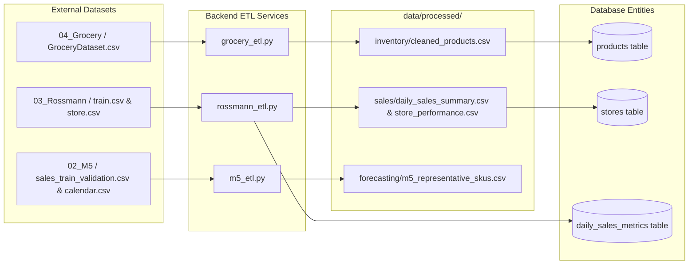

# Smart Retail Intelligence System — Data Pipeline Architecture

This document details the repeatable ETL (Extract, Transform, Load) pipelines for data ingestion, cleaning, and transformation across all supported retail datasets.

---

## 1. Pipeline Overview

Raw datasets reside outside the repository (`SMART_RETAIL_DATA_ROOT`) to prevent repository bloat. The ETL processes transform raw files into structured outputs in `data/processed/` and persist key catalog, store, and analytics entities into the database (`SQLite` locally, `PostgreSQL` in production).



---

## 2. Dataset Pipeline Details

### A. Grocery Product Catalog Pipeline

* **Source File:** `{SMART_RETAIL_DATA_ROOT}/04_Grocery/raw/GroceryDataset.csv`
* **Transformations (`app/services/grocery_etl.py`):**
  1. **Price Normalization:** Strips currency symbols (`$`), commas, and whitespace, casting valid values to `float`. Missing values defaulted to `0.0`.
  2. **Discount Parsing:** Regex extraction of discount percentages (e.g. `"20% off"` $\rightarrow$ `20.0`) and dollar off amounts.
  3. **Rating Extraction:** Parses star ratings from descriptive strings (e.g. `"Rated 4.3 out of 5 stars..."` $\rightarrow$ `4.3`).
  4. **Text Cleaning:** Normalizes line breaks and whitespace across `Title`, `Feature`, `Sub Category`, and `Product Description`.
* **Processed Output File:** `data/processed/inventory/cleaned_products.csv` (1,757 records across 19 sub-categories).
* **Database Destination:** `products` table in database.
* **API Endpoints:** `GET /api/v1/products`, `GET /api/v1/products/{id}`.

---

### B. Rossmann Store Sales & Business Analytics Pipeline

* **Source Files:** `{SMART_RETAIL_DATA_ROOT}/03_Rossmann/raw/train.csv` & `store.csv`
* **Transformations (`app/services/rossmann_etl.py`):**
  1. **Store Aggregations:** Computes historical `total_sales`, `total_customers`, `avg_daily_sales`, and `avg_daily_customers` for each store across 942 operating days.
  2. **Network Daily Metric Aggregations:** Computes daily network `total_sales`, `total_customers`, `open_stores`, and `promo_stores`.
  3. **Promotional Lift Analysis:** Computes revenue variance during promotional periods vs. standard operating periods.
* **Processed Output Files:**
  - `data/processed/sales/store_performance.csv` (1,115 stores).
  - `data/processed/sales/daily_sales_summary.csv` (942 days time series).
* **Database Destination:** `stores` and `daily_sales_metrics` tables.
* **API Endpoints:** `GET /api/v1/analytics/overview`, `GET /api/v1/analytics/sales`, `GET /api/v1/stores`.

---

### C. M5 Demand Forecasting Preparation Pipeline

* **Source Files:** `{SMART_RETAIL_DATA_ROOT}/02_M5/raw/sales_train_validation.csv`, `calendar.csv`, and `sell_prices.csv`
* **Transformations (`app/services/m5_etl.py`):**
  1. **Velocity Ranking & Stratified Selection:** Identifies top high-velocity items per category (`FOODS`, `HOBBIES`, `HOUSEHOLD`) to produce a lightweight representative subset of 48 SKUs.
  2. **Wide-to-Long Transformation:** Melts wide daily sales columns (`d_N`) into longitudinal daily records for the recent 365-day observation window.
  3. **Feature Enrichment:** Merges calendar holiday events, day-of-week, and unit sell prices per store.
* **Processed Output File:** `data/processed/forecasting/m5_representative_skus.csv` (17,520 records).
* **Database / Module Destination:** Serves as training and evaluation input for Milestone 4 (Predictive Restocking & Demand Forecasting).

---

## 3. How to Execute the Ingestion Pipeline

To execute all data transformations and populate the database, run:

```bash
# From repository root
python backend/app/services/data_manager.py
```

Or programmatically in Python:
```python
from app.services.data_manager import run_all_etl

results = run_all_etl()
print(results)
```
